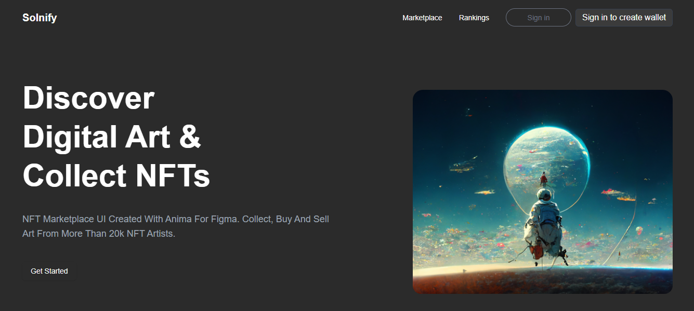
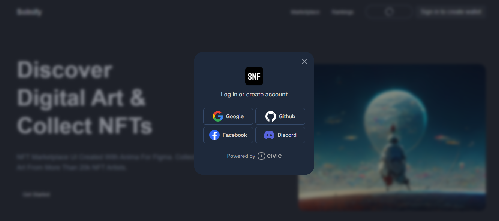

# 🖼️ Solnify — The Next-Gen NFT Marketplace Powered by Civic Auth

[](https://nextjs.org/)  
[](https://www.civic.com/)  
[](#)

---

**Solnify** is a decentralized NFT marketplace built on Solana, where creators and collectors meet in a clean, secure, and seamless environment. With **Civic Auth** integration, Solnify offers a frictionless onboarding experience using embedded wallets and real-human authentication — ensuring a bot-free, trusted marketplace.



---

## ✨ Features of Solnify

- 🎨 Mint, list, and trade NFTs directly on Solana.
- 👤 Auto-generated profiles using Civic-authenticated data.
- 🛡️ Route protection and bot prevention via Civic middleware.
- 🔐 Embedded wallets for users — no need for external wallet apps.
- 🚀 Smooth UX for both Web3 natives and beginners.
- 🧠 Built with Next.js, Tailwind CSS, and Civic SDK.

---

## 🛡️ Civic Authentication Integration

**Solnify** leverages [**Civic Auth**](https://auth.civic.com/dashboard) to ensure that only real, verified users can access marketplace features. It removes the need for wallet extensions by embedding a wallet within the app, while securing all sensitive user flows like minting, profile creation, and account access.



### ✅ Why We Chose Civic

- Verifies real users with zero data leaks
- Prevents fake/bot accounts from abusing the platform
- Provides users with instant Solana wallets
- Simplifies the onboarding process drastically

### 🔐 How Civic Works in Solnify

- 🔓 On first visit, users authenticate through Civic.
- 🧠 Civic middleware protects critical routes — if you're not logged in, you’re blocked from minting, trading, or viewing your dashboard.
- 🧾 During profile creation, user data is pulled directly from Civic Auth.
- 💼 If a user doesn't have a wallet, Civic auto-generates an **embedded Solana wallet** for them on login.
- 🎁 All NFT actions — minting, purchasing, and transfers — happen through the user’s Civic wallet.

> Civic makes Solnify human-first, secure, and ready for the next billion users on Solana.

---

## 🚀 Getting Started (For Developers)

To run Solnify locally:

```bash
# Install dependencies
npm install

# Start the development server
npm run dev
```
